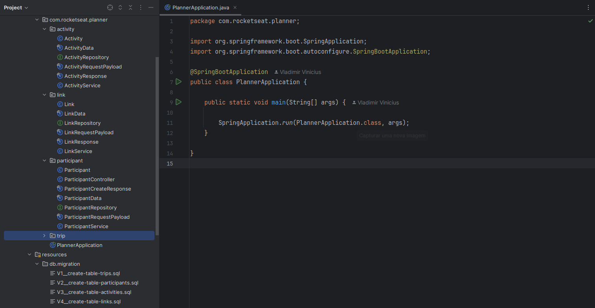

<h1 align="center"> Planner </h1>

NLW é um evento exclusivo e gratuito, promovido pela Rocketseat para ensino de tecnologias WEB.  

  

## 🚀 Tecnologias

Esse projeto foi desenvolvido com as seguintes tecnologias:

- Java
- Spring Boot
- Git e Github
- Figma

## 💻 Projeto

O Planner é um planejador de viagens que tem como objetivo ajudar o usuário a organizar viagens à trabalho ou lazer.

---

Feito com ♥ by Rocketseat | [Participe da nossa comunidade!](https://discord.gg/rocketseat)